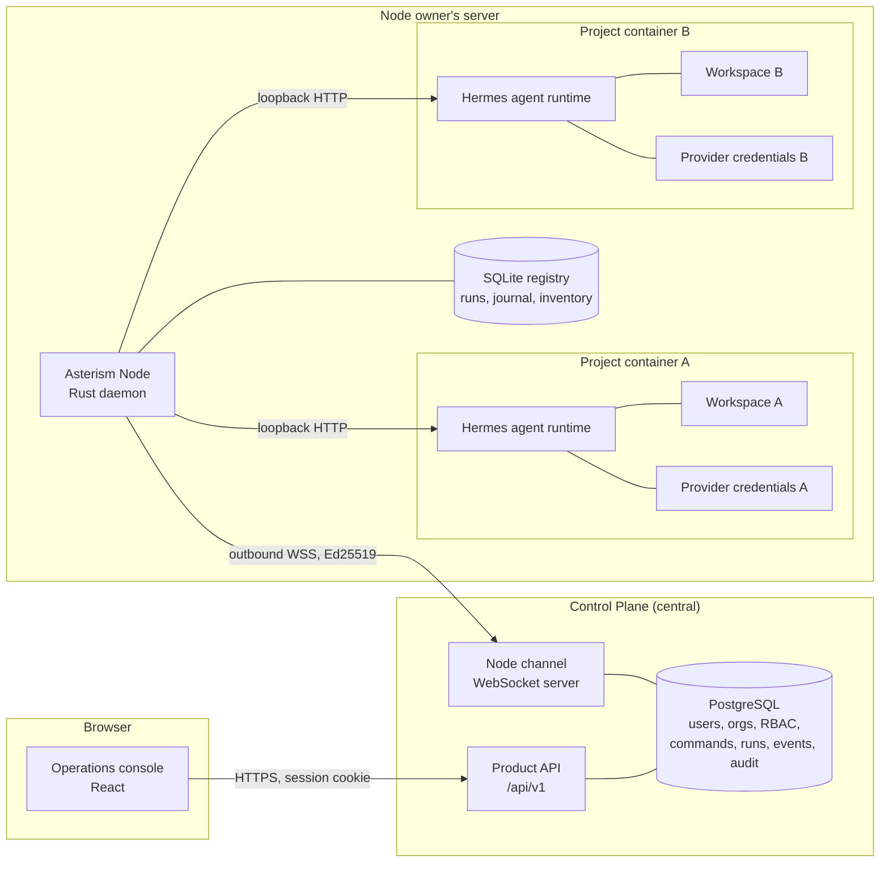

# Architecture

Asterism centrally manages persistent AI development agents that run on remote
project servers. This document describes the accepted architecture as of
Phase H. It is the reference for what each component owns; anything in an
earlier phase report that contradicts it is superseded.

## Components

The browser never contacts a Node or Hermes. Every connection from the Node to
the Control Plane is **outbound**; the Node exposes no inbound TCP port.

## Control Plane responsibilities

* Users, organizations, memberships, invitations, and role-based access control.
* Browser sessions, CSRF, and Origin enforcement.
* Product state: which Nodes and projects exist, and their reported status.
* Durable **commands** addressed to a Node, with at-least-once delivery and
  deduplication by command id.
* Central run records, the ingested event journal, and replayable event history.
* Audit log.
* Node enrollment and identity rotation.

The Control Plane never holds provider credentials, never dials a Node, and has
no column for a host filesystem path. It addresses work by project id.

## Node responsibilities

The Asterism Node is a Rust daemon running on a server the Node owner controls.

* Maintains one authenticated outbound WebSocket session to the Control Plane,
  with exponential backoff across outages.
* Owns the **project container lifecycle**: create, start, stop, remove, and
  configuration pinning (image digest, model, provider, terminal working
  directory).
* Owns the **durable local run registry** (SQLite, WAL) — runs, their status, and
  the per-run event journal with monotonic sequence numbers.
* Owns **reconciliation**: after a restart or a lost event stream, it asks the
  backend what it still knows and resolves each non-terminal run honestly.
* Owns **approvals, cancellation, and retry semantics**.
* Enforces **single-flight per project**: one active run per project at a time,
  held by an advisory `flock(2)` that the kernel releases if the process dies.
* Exposes a local control API over a Unix socket only. No inbound TCP.

The Node resolves a project id to a workspace path that only the operator ever
supplied. A path arriving from the wire is not part of the data model.

## Hermes responsibilities

Hermes is the agent runtime inside each project container. Hermes owns:

* the agent loop;
* tools and their execution;
* provider integration and model calls;
* memory and context;
* approval requests;
* all execution behavior.

**Asterism does not reimplement any of this.** The supported default is the
normal Hermes agent loop. Native Codex App-Server support is experimental and
disabled by default because its approval-forwarding path is incomplete: approval
requests raised under that path do not reach the Asterism API, so an operator
cannot see or answer them.

## Project container lifecycle

One project, one container. Each container gets:

* its own workspace bind mount;
* its own Hermes data directory holding its own provider credentials;
* its own host port, recorded on the project as its runtime endpoint;
* a digest-pinned runtime image, published at
  `ghcr.io/patternity/asterism-project-runtime` and referenced by manifest
  digest rather than by tag.

A Node supervising several projects resolves the Hermes endpoint **per project**.
Approvals, cancellation, and reconciliation resolve it too — each addresses a
specific project and would otherwise reach the wrong container.

Provisioning pins the model, the provider, and the terminal working directory
rather than inheriting the image defaults, which are not necessarily compatible
with the configured provider.

## Run and event ownership

A run exists in two places with different authority.

| | Node | Control Plane |
| --- | --- | --- |
| Creates the backend run | yes | no |
| Assigns the sequence numbers | yes | no |
| Decides the terminal status | **yes** | no |
| Durable history for the browser | local journal | ingested journal |
| Replay to an operator | over the local socket | over SSE |

The Node is the authority on what a run did. The Control Plane records what the
Node reported and never invents an outcome it did not observe.

Events carry a per-run monotonic `seq`. The Control Plane acknowledges only a
**gapless prefix**, so a missing frame stops the cursor instead of silently
skipping history. Replay is by cursor (`since_seq`, `Last-Event-ID`).

## Retry and reconciliation semantics

* **Reconciliation** runs at Node startup and periodically. For every
  non-terminal run it asks the backend what it still knows. If the backend no
  longer knows the run, the Node records a terminal status — `interrupted` or
  `lost` — and emits an `asterism.reconciled` event carrying the new status. The
  Control Plane treats a terminal `new_status` on that event as ending the run.
* **Retry** never resurrects a run. It creates a *new* run linked to the original
  through `retry_of_run_id`, and the product API exposes `replacement_run_id` so
  both directions of the relationship are navigable. Only `interrupted` and
  `lost` runs are retryable; retrying an active or completed run is refused.
* **Cancellation** is idempotent. Repeating it reaches the Node's idempotency
  path rather than failing.

## Multi-project behavior

Command dispatch to one Node is fair across that Node's projects. Each project's
queue is ranked independently and the ranks are interleaved, so a dispatch round
takes each project's oldest command before any project's second. Strict FIFO
would let one busy project starve every other. Ordering is deterministic —
`(rank, created_at, command_id)` — so concurrent Control Plane instances agree on
priority, and `FOR UPDATE SKIP LOCKED` keeps them off each other's rows.

## Security boundaries

Asterism enforces these boundaries:

* **Node identity.** An Ed25519 private key that never leaves the Node home and
  is stored `0600`. Rotation replaces it without changing the `node_id`.
* **Control Plane secrets.** Never present on a Node or in a project container.
* **Host separation.** A project container has no Docker socket and no access to
  the Node home, the Node registry, or the Node private key.
* **Project-to-project isolation.** Separate containers, workspaces, credential
  stores, and endpoints. One project's container holds credentials for that
  project only.
* **Tenant isolation.** Composite foreign keys `(organization_id, node_id)` make
  a cross-organization Node/project/run relation impossible at the database
  level, not merely in application code.

## The Hermes trust domain

The project workspace, the Hermes runtime, and the provider credentials the Node
owner installs for that project form **one trust domain**.

Asterism does not claim a boundary inside that domain. Commands the model
generates run as the same OS user that owns the credential stores for that same
project; they can read them. That is a property of the trust model the Node owner
chose when they supplied those credentials for that project — it is not an
unresolved Asterism defect.

See [`trust-model.md`](trust-model.md) for the full statement and its
consequences.
